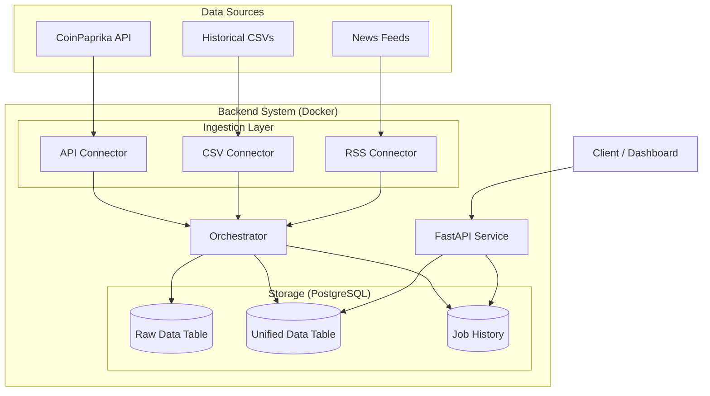

# Data Ingestion and API System

A robust ETL (Extract, Transform, Load) pipeline designed to ingest cryptocurrency data from multiple sources, normalize it into a unified schema, and expose it via a high-performance REST API.

---

## 🏗️ System Architecture

The system follows a modular microservices-ready architecture:



### Key Components
1.  **Ingestion Layer**: Connectors (`api/csv/rss_source.py`) fetch data from external providers.
2.  **Orchestrator**: Manages the ETL process, handles retries, and ensures data consistency.
3.  **Storage**: PostgreSQL stores full raw payloads (for auditing) and normalized data (for fast querying).
4.  **API Layer**: FastAPI provides endpoints for data retrieval, ingestion triggering, and system monitoring.

---

## 🚀 Local Setup

### Prerequisites
- Docker & Docker Compose
- Windows (Powershell) or Linux/Mac

### Quick Start (Windows)
We provide a `make` utility for easy management:

1.  **Start Services**:
    ```powershell
    .\make up
    ```
    *Builds images and starts the database and API on port 8000.*

2.  **Stop Services**:
    ```powershell
    .\make down
    ```

3.  **Run Tests**:
    ```powershell
    .\make test
    ```

---

## 📡 API Reference

**Base URL**: `http://13.204.240.244:8000/api/v1`
**Documentation**: [http://13.204.240.244:8000/docs](http://13.204.240.244:8000/docs)

### Authentication
All endpoints require an API Key header.
- **Header**: `x-api-key`
- **Default Key**: `secret-key`

### Common Endpoints

| Method | Endpoint | Description |
| :--- | :--- | :--- |
| `GET` | `/health` | Check DB status and system health |
| `POST` | `/ingest` | Trigger the ETL process manually |
| `GET` | `/data` | Fetch unified data (supports `symbol`, `source`, `limit`) |
| `GET` | `/stats` | View past ETL job execution statistics |

#### Example Use (cURL)
```bash
curl -X GET "http://13.204.240.244:8000/api/v1/health" -H "x-api-key: secret-key"
```

---


## 🛠️ Configuration

Configuration is managed via `.env` or `core/config.py`.

| Variable | Default | Description |
| :--- | :--- | :--- |
| `DATABASE_URL` | Check code | PostgreSQL connection string |
| `API_KEY` | `secret-key` | Security key for API access |
| `LOG_LEVEL` | `INFO` | Logging verbosity |

---
